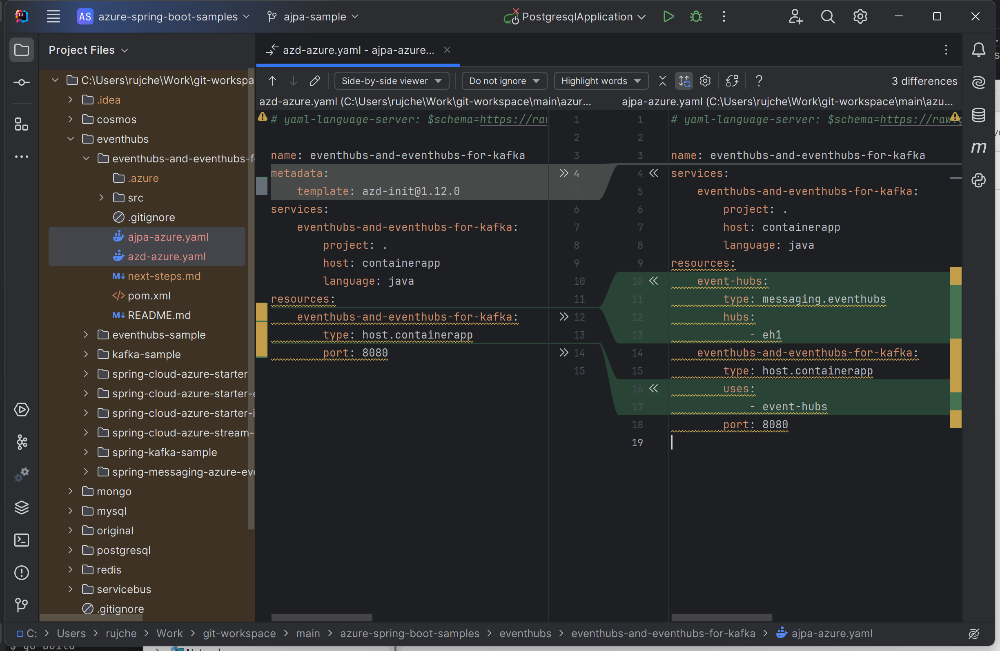
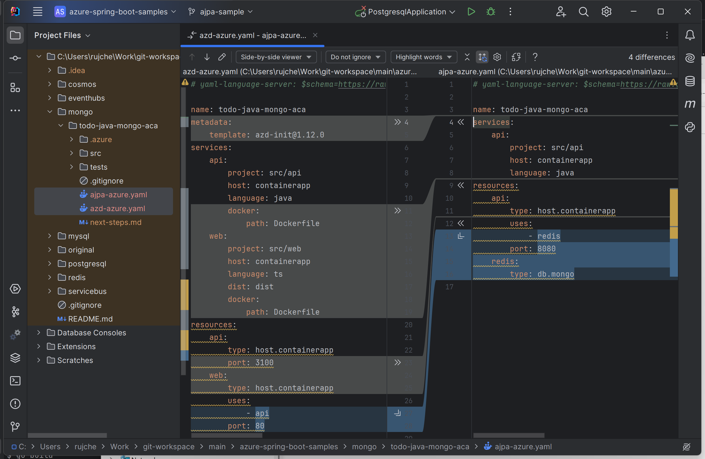
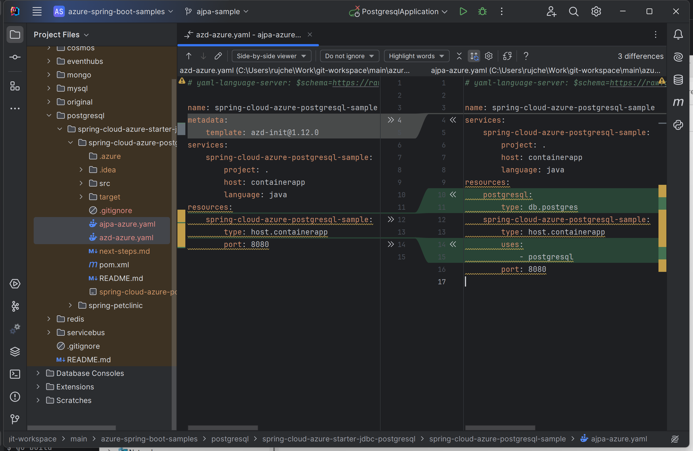
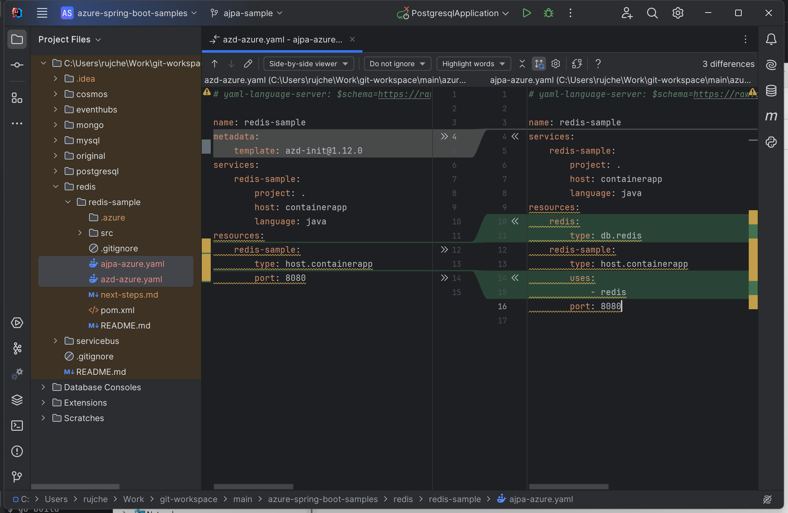
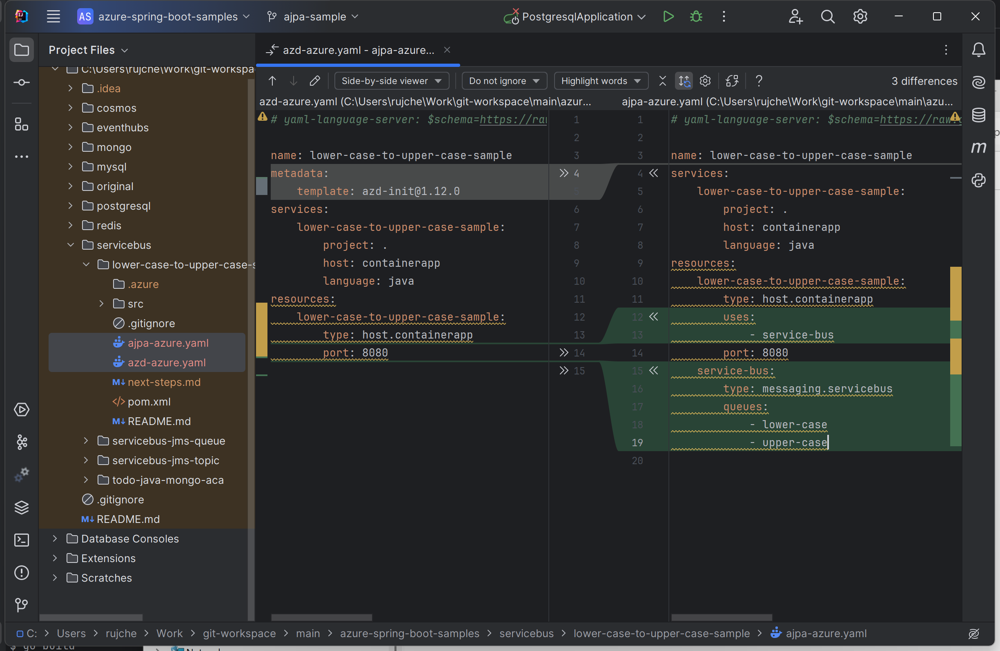

# Samples

This doc will give a summary comparing from azd generated azure.yaml and ajpa generated azure.yaml

## Link to sample projects

https://github.com/rujche/azure-spring-boot-samples/tree/ajpa-sample

## Screenshots of azd generated azure.yaml and ajpa generated azure.yaml

1. cosmos/cosmos-sample

   

2. eventhubs/eventhubs-and-event-hubs-for-kafka

   

3. mongo/todo-java-mongo-aca

   

4. postgresql/spring-cloud-azure-postgresql-sample

   

5. redis/redis-sample

   

6. servicebus/lower-case-to-upper-case-sample

   

