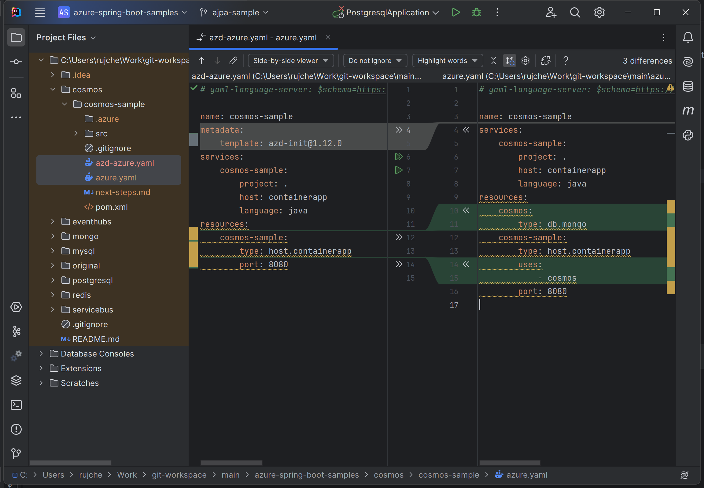

# Samples

This doc gives a list of sample project's azure.yaml generated by azd and ajpa.

1. [rujche/azure-spring-boot-samples/ajpa-sample](https://github.com/rujche/azure-spring-boot-samples/tree/ajpa-sample)

   1. cosmos/cosmos-sample

      

   2. eventhubs/eventhubs-and-event-hubs-for-kafka

      

   3. mongo/todo-java-mongo-aca

      

   4. postgresql/spring-cloud-azure-postgresql-sample

      

   5. redis/redis-sample

      

   6. servicebus/lower-case-to-upper-case-sample

      

2. [azure-javaee/spring-petclinic-microservices/sjad](https://github.com/azure-javaee/spring-petclinic-microservices/tree/sjad)

   
   
